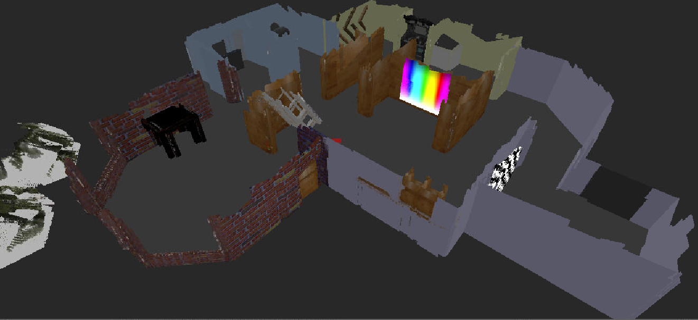
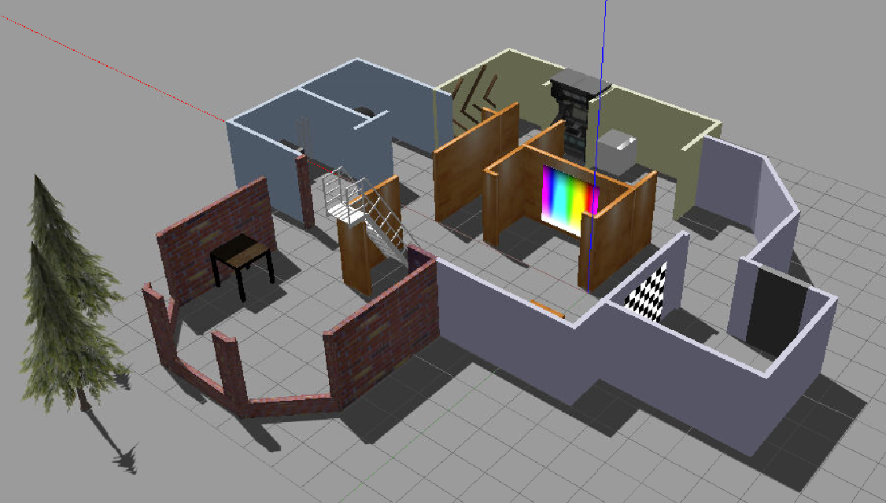
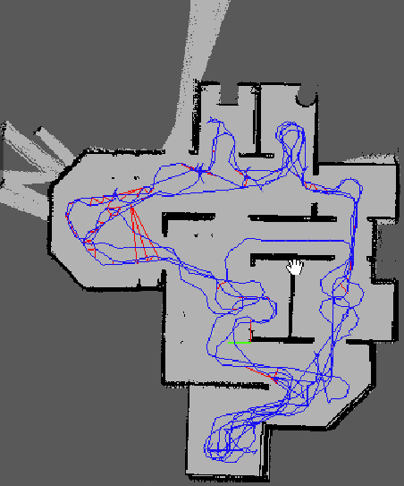
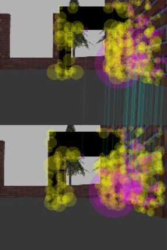
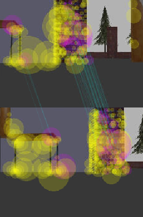
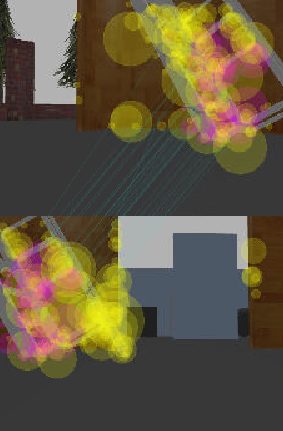

# RoboProj4
Project 4 of the Udacity Robotics Software Engineer NanoDegree.

Demonstration of Real Time Appearance Based Mapping (RTAB) for Simultaneous Localization & Mapping (SLAM)
with ROS. A robot equipped with RBGD camera builds a 3D point cloud of a simulated Gazebo World. The RTAB
package finds global loop closures as a the robot cycles around the environment.

## Dependencies

ROS: Install Robot Operating System (ROS) by following these instructions: http://wiki.ros.org/Installation
   * Follow the instructions for a Desktop-Full Install.

Gazebo: Follow the instructions for your environment at http://gazebosim.org/tutorials?cat=install

Ubuntu one line installation:
```bash
$ curl -sSL http://get.gazebosim.org | sh
```

## Installation

Step 1:
Clone the repository into your workspace
```bash
$ git clone https://www.github.com/joestilin/RoboProj4
```

Step 2:
Initialize a catkin workspace inside src
```bash
$ cd /RoboProj4/catkin_ws/src
$ catkin_init_workspace
```
Step 3:
Move up to the catkin workspace root, build the package, and source the environment
```bash
$ cd ..
$ catkin_make
$ source devel/setup.bash
```

## Usage

1. Launch ```world.launch```
```bash
$ cd /RoboProj4/catkin_ws
$ roslaunch my_robot world.launch
```

2. Open a new terminal and run ```teleop_keyboard_twist.py```
```bash
$ cd /RoboProj4/catkin_ws
$ source devel/setup.bash
$ rosrun teleop_twist_keyboard teleop_twist_keyboard.py
```
3. Open a new terminal and launch ```mapping.launch```
```bash
$ cd /RoboProj4/catkin_ws
$ source devel/setup.bash
$ roslaunch my_robot mapping.launch
```
You can move around the Gazebo world with keyboard commands. The rtab ROS node will store its
database result in the root of your directory in a file called ```rtabmap.db```

4. View result with ```rtabmap-databaseViewer```

```bash
$ rtabmap-databaseViewer pathtofile
```

## What does this look like?
#### Generated 3D pointcloud alongside original world



#### Graph of environment:


#### Examples of global loop closure:






